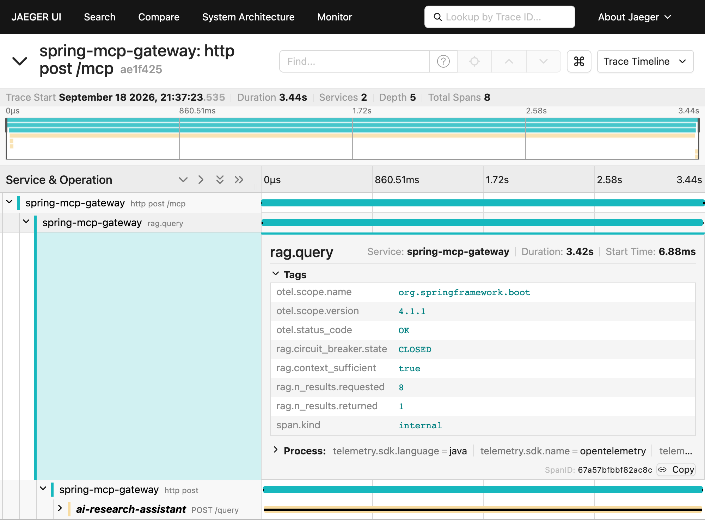

# spring-mcp-gateway

[](https://github.com/juan-casimiro/spring-mcp-gateway/actions/workflows/ci.yml)

A Spring Boot MCP gateway that exposes an existing FastAPI retrieval-augmented generation (RAG) service to MCP clients.

The gateway publishes MCP tools over Streamable HTTP. MCP-facing models are mapped to application models, and the `ResearchGateway` abstraction isolates application code from the FastAPI `/query` JSON contract.

```text
MCP client → MCP tool → ResearchGateway → RagClient → FastAPI /query
```

## One request, one trace



One `query_research_corpus` call (the CT-FFR question from
[Verify with MCP Inspector](#verify-with-mcp-inspector)) in Jaeger. The gateway's
`rag.query` span covers the whole query, retries included, and carries what a
generic HTTP trace would not: `rag.n_results.requested` / `rag.n_results.returned`,
`rag.context_sufficient` and `rag.circuit_breaker.state`. Its outbound HTTP call
continues into the FastAPI service's `POST /query` span under the same trace ID,
so the trace crosses the Java/Python boundary; 3.40 s of the 3.44 s total is
inside the RAG service. Four internal ASGI spans under `POST /query` are
collapsed.

Reproduce it with the [Docker Compose stack](#docker-compose-full-stack); the
endpoints, metrics and attributes are detailed under [Observability](#observability).

## MCP tools

### `query_research_corpus`

Searches the biomedical research corpus and returns an evidence-backed answer.

Inputs:

- `question` (required string): the question to answer
- `resultCount` (optional integer): maximum retrieved chunks; defaults to `8`

Output:

- `answer`: generated answer
- `sources`: ordered source identifiers
- `contextSufficient`: whether the retrieved context was sufficient
- `insufficiencyReason`: explanation when context is insufficient; otherwise may be `null`

The gateway pins the upstream `use_bm25` and `use_query_rewriting` flags off explicitly rather than inheriting the RAG service's defaults, so a change to those defaults cannot silently alter gateway behaviour. On this corpus, query rewriting measured no change and BM25 measured one attributable regression — see [ADR-001 in `ai-research-assistant`](https://github.com/juan-casimiro/ai-research-assistant/blob/main/adr/001-chunking-and-retrieval.md) for the full evaluation.

## Prerequisites

- Java 25
- The included Maven Wrapper
- The FastAPI RAG service from [`ai-research-assistant`](https://github.com/juan-casimiro/ai-research-assistant) for running the application or live integration tests

Set up and start the upstream service by following its [`README`](https://github.com/juan-casimiro/ai-research-assistant#readme).

## Configuration

The upstream RAG service defaults to `http://localhost:8000`. Override it with:

```bash
export RAG_BASE_URL=http://your-rag-service:8000
```

The configured connection and read timeouts are `4s` and `60s`, respectively.

OTLP metric and trace export are disabled by default for local development. Enable them independently with:

```bash
export OTEL_METRICS_EXPORT_ENABLED=true
export OTEL_TRACING_EXPORT_ENABLED=true
```

The OTLP trace exporter targets `http://localhost:4318/v1/traces` by default;
override it with `OTEL_EXPORTER_OTLP_TRACES_ENDPOINT` (Docker Compose sets
this to the bundled Jaeger container — see
[Docker Compose (full stack)](#docker-compose-full-stack)).

Tracing samples all requests by default. See [Observability](#observability) for the Actuator endpoints, metrics, and RAG-specific span attributes.

## Authentication

Authentication is enabled for `/mcp` and the exposed Actuator endpoints, except
`/actuator/health`. Docker and local Java execution both use the public demo token
`local-demo-token` by default. No credential setup or additional service is needed.
Send this header on **every** protected request, including within an MCP session:

```text
Authorization: Bearer local-demo-token
```

Missing, malformed, or incorrect credentials return `401 Unauthorized` with a
`WWW-Authenticate: Bearer` challenge, before any RAG call. Tokens in query strings
are not accepted. The gateway never forwards your token to the RAG service.

This is an academic shared-token demonstration, **not MCP OAuth authorization**:
there is no login, discovery, token issuance, user identity, or expiration. The
configured token is compared locally in memory using `MessageDigest.isEqual`.
A startup warning identifies use of the public demo credential without printing it.
Anyone who knows the demo value can authenticate; keep the demo on localhost.
For deployment beyond localhost, use a private token and HTTPS.

### Optional: use a private token

Generate a random value and start the stack from the same shell:

```bash
export MCP_API_TOKEN="$(openssl rand -hex 32)"
docker compose up --build
```

For local Java execution, use the same exported variable with
`./mvnw spring-boot:run`. With `docker run`, pass `-e MCP_API_TOKEN` to forward it.
Use your chosen token in Inspector instead of the demo value. Keep it in your
chosen local secret storage if you want to reuse it; generating another value
creates a different token. Do not commit private tokens or paste them into logs.

Compose also reads `MCP_API_TOKEN` from a local `.env` file (ignored by Git).
Plain Java execution does not automatically load `.env`; export the variable.
A configured empty/blank token prevents startup. Only one token is accepted: an
override replaces the demo value. To rotate it, change the variable and recreate
the gateway (`docker compose up -d --force-recreate gateway`) or restart the local
Java process. Existing MCP sessions still need the new token on their next request.

### Quick authentication checks

With the gateway running and the default demo token:

```bash
# Public health check: 200 when healthy; does not call the RAG service.
curl -i http://localhost:8080/actuator/health

# Protected MCP request without credentials: 401.
curl -i -X POST http://localhost:8080/mcp

# Valid credentials on a protected endpoint: 200.
curl -i -H 'Authorization: Bearer local-demo-token' \
  http://localhost:8080/actuator/metrics
```

Use [MCP Inspector](#verify-with-mcp-inspector) below to exercise initialization,
tool discovery, and a complete tool call.

## Build and run

Build the application:

```bash
./mvnw clean package
```

Run the gateway after starting the FastAPI RAG service:

```bash
./mvnw spring-boot:run
```

## Docker

Docker with BuildKit is the only build prerequisite; no local Java, Maven cache,
or prebuilt `target/` directory is needed. From the repository root:

```bash
docker build --pull -t spring-mcp-gateway:local .
```

The builder uses Java 25 and the Maven Wrapper, then extracts the JAR with
[Spring Boot 4.1 tools mode](https://docs.spring.io/spring-boot/reference/packaging/container-images/dockerfiles.html).
The runtime contains a Java 25 JRE, curl for health probes, and separate Boot
dependency/application layers. It runs as UID/GID `10001:10001`; application
files are root-owned. Java runs as PID 1 and receives Docker stop signals directly.

BuildKit caches Maven downloads across source changes. Wrapper/POM inputs are
copied before source files, and stable dependency layers precede application
code. Builds also work with an empty cache. The Java 25 Ubuntu Noble base tags
receive updates; `--pull` refreshes them. These are repeatable source builds,
not a promise of byte-identical images across base-image updates. No platform is
hardcoded; Docker selects the base image for the target architecture.

Image packaging skips test execution; run `./mvnw clean test` separately before
using the image. The Docker build context includes only the Maven build inputs
and source tree, excluding local build outputs, Git history, and `.env` files.
Never place credentials in source resources or pass secrets as build arguments.

### Run and configure

Set `RAG_BASE_URL` to an address reachable **from the container**:

```bash
docker run -d --name mcp-gateway \
  -p 127.0.0.1:8080:8080 \
  -e RAG_BASE_URL=http://rag-service:8000 \
  spring-mcp-gateway:local
```

Replace `rag-service` with your upstream hostname. For another container, attach
both containers to the same user-defined Docker network (`--network <network>`)
and use the upstream container's network name. For a service on the host, Docker
Desktop provides `host.docker.internal`; on Linux Docker Engine, add
`--add-host=host.docker.internal:host-gateway` and ensure the upstream listens on
an interface reachable from Docker. The existing `localhost:8000` application
default refers to the gateway container itself and will not reach a separate RAG
service. For a one-command local demo stack that wires this up automatically,
see [Docker Compose (full stack)](#docker-compose-full-stack) below.

All Spring configuration remains external through environment variables, such
as `RAG_BASE_URL`, `RAG_RATE_LIMIT_FOR_PERIOD`, `OTEL_TRACING_EXPORT_ENABLED`, and
`SERVER_PORT`. Use `JAVA_TOOL_OPTIONS` for JVM options. Future secrets should be
injected at runtime using your deployment's secret mechanism; Spring config-tree
imports can read mounted secret files. Do not bake them into the image.

This demo uses the default Actuator base path `/actuator`, with public health
checks at `/actuator/health`. Keep these paths unchanged; custom Actuator paths
are outside the supported demo configuration.

The default container port is `8080`. If changing ports, adjust the port mapping
and set `SERVER_PORT`; the built-in healthcheck follows it automatically. For
example, to use port `9090`:

```bash
docker run -d --name mcp-gateway-custom \
  -p 127.0.0.1:8081:9090 \
  -e SERVER_PORT=9090 \
  -e RAG_BASE_URL=http://rag-service:8000 \
  spring-mcp-gateway:local
```

### Verify and stop

```bash
docker logs mcp-gateway
curl --fail http://localhost:8080/actuator/health
docker inspect --format '{{.State.Health.Status}}' mcp-gateway
docker exec mcp-gateway id
```

Expect a JSON health response with `"status":"UP"`, Docker health `healthy` after the first successful
probe, and UID/GID `10001`. The probe runs every 30 seconds, permits 30 seconds
for startup, and marks the container unhealthy after three consecutive failures.
It uses a four-second HTTP timeout and fails on HTTP errors or connection errors.
Docker health status does not itself restart the container.

By default, Actuator health reports gateway health only: it does not verify RAG
reachability or perform paid retrieval/LLM calls. Setting `RAG_HEALTH_ENABLED=true`
adds a probe of the RAG service's `/health` (at `RAG_BASE_URL`, 1s connect / 2s read
timeout, no retrieval and no LLM call) to `/actuator/health`, so the gateway reports
`DOWN` (HTTP 503) while RAG is unreachable or not ready. The probe bypasses the
query path's retry, circuit breaker, and rate limiter. Note the container
`HEALTHCHECK` polls this same endpoint, so with the probe on it also reflects RAG.
Use the MCP Inspector flow below against `http://localhost:8080/mcp` to verify a
real upstream query separately.

```bash
docker stop mcp-gateway
docker rm mcp-gateway
```

### Docker Compose (full stack)

`docker-compose.yml` brings up the gateway, the RAG service, and Jaeger with
one command:

```bash
docker compose up --build
```

This assumes [`ai-research-assistant`](https://github.com/juan-casimiro/ai-research-assistant)
is checked out as a sibling directory of this repository (both under the same
parent directory). Override the path with `RAG_SERVICE_PATH` if yours lives
elsewhere:

```bash
RAG_SERVICE_PATH=/path/to/ai-research-assistant docker compose up --build
```

The RAG service's own `docker-compose.yml` is reused via Compose's `include`,
so its build, healthcheck, Chroma volume, and optional `ollama` profile stay
defined in one place. Set `ANTHROPIC_API_KEY` in `ai-research-assistant/.env`
(or use `--profile ollama`, per that repo's README) before starting.

The gateway's `depends_on` condition waits for the RAG service's healthcheck —
which polls `/health` — to report `healthy`, not merely for the container to
start, so the gateway never starts querying before the corpus is ready.

Once up:

- Gateway: `http://localhost:8080/mcp` (see [Verify with MCP Inspector](#verify-with-mcp-inspector))
- RAG service: `http://localhost:8000/health`
- Jaeger UI: `http://localhost:16686`

Traces export to Jaeger automatically, no manual configuration needed: the
gateway over OTLP/HTTP (port `4318`), and the RAG service (JUA-62) over
OTLP/gRPC (port `4317`) — `docker-compose.yml` sets each service's exporter
env vars for you. Tear down with `docker compose down`.

### Docker Compose (published images)

`docker-compose.images.yml` runs the same gateway + RAG pairing from images
published to GHCR, instead of building either service from source:

```bash
docker compose -f docker-compose.images.yml up
```

Unlike the local-build stack above, this does not need
`ai-research-assistant` checked out as a sibling directory, and does not
start Jaeger. Set `ANTHROPIC_API_KEY` in the environment or in a local
`.env` file (Compose loads `.env` from the current directory automatically)
before starting, or use `--profile ollama` per
[ai-research-assistant's README](https://github.com/juan-casimiro/ai-research-assistant#appendix-local-llm-with-ollama).

By default both images resolve to `latest`, which is convenient for a quick
demo but not reproducible — `latest` moves as each repository publishes new
commits to `main`. For a reproducible run, pin both images to explicit
tags, commit SHAs recommended:

```bash
GATEWAY_IMAGE=ghcr.io/juan-casimiro/spring-mcp-gateway:<sha> \
RAG_IMAGE=ghcr.io/juan-casimiro/ai-research-assistant:<sha> \
docker compose -f docker-compose.images.yml up
```

Compatibility between the two images is governed by the gateway/RAG HTTP
contract, not by the repositories sharing a version number — pinned tags
from unrelated points in time are not guaranteed to be compatible. `latest`
on each image is a known-compatible pair as of this Compose revision.

The gateway's `depends_on` condition waits for the RAG service's
healthcheck the same way the local-build stack does, so the gateway never
starts querying before the corpus is ready. Once up:

- Gateway: `http://localhost:8080/mcp`
- RAG service: `http://localhost:8000/health`

Tear down with `docker compose -f docker-compose.images.yml down`.

To verify that the gateway's own `RAG_BASE_URL` configuration reaches the RAG
service over the Compose network, without a paid LLM call, run
`./scripts/smoke-test-images.sh`. It starts both images with
`RAG_HEALTH_ENABLED=true` (off by default in the Compose file), requires the
gateway's `/actuator/health` to be `UP`, then stops RAG and requires the gateway
to turn `DOWN`. That last step fails against a gateway image that predates the
probe. The script uses its own Compose project name and host ports
`18080`/`18000`, so it can run beside a stack on the default ports; override host
ports with `GATEWAY_HOST_PORT` and `RAG_HOST_PORT`.

## Verify with MCP Inspector

If the [Docker Compose stack](#docker-compose-full-stack) is already running,
skip to step 3. Steps 1–2 are only for starting the services locally without Compose.

1. Start `ai-research-assistant` by following its linked README above.
2. Start the gateway:

   ```bash
   ./mvnw spring-boot:run
   ```

3. In another terminal, start MCP Inspector:

   ```bash
   npx @modelcontextprotocol/inspector@2.6.0
   ```

4. In Inspector 2.6.0, choose **Add Servers → Add manually**, enter a server ID
   (for example `research-gateway`), choose **streamable-http**, and enter
   `http://localhost:8080/mcp`. Click **Add**.
5. On that server's card, open **Settings → Custom Headers → + Add Header**.
   Set the name to `Authorization` and the value to `Bearer local-demo-token`
   (or `Bearer <your-private-token>` if overridden). Close Settings, then turn
   on the server's connection switch. Leave **Protocol Era** at **Legacy**.
   Do not configure OAuth for this static-token demo.
6. Open **Tools** and confirm that `query_research_corpus` is listed.
7. Invoke the tool with:

   ```json
   {
     "question": "What does CT-FFR measure in coronary artery disease?",
     "resultCount": 8
   }
   ```

   `resultCount` is optional and defaults to `8`.

The end-to-end check succeeds when Inspector connects, discovers the tool, and the invocation reaches the upstream FastAPI service and returns a grounded `answer`, ordered `sources`, `contextSufficient`, and `insufficiencyReason`.

If you connect before adding the header, Inspector may attempt OAuth discovery
and mark the connection **Failed**. Add the custom header and reconnect; no OAuth
server is required. These instructions use Inspector 2.6.0 (Node.js 22.19+).

## Observability

Spring Boot Actuator, Micrometer, and OpenTelemetry provide the foundation. On
top of generic HTTP telemetry, the gateway records RAG-specific attributes and
per-tool metrics.

### Actuator endpoints

Exposed over HTTP on the application port (`8080` by default):

| Endpoint | Shows |
| --- | --- |
| `/actuator/health` | Gateway health; also checks RAG when `RAG_HEALTH_ENABLED=true` |
| `/actuator/metrics` | Every Micrometer metric; `/actuator/metrics/<name>` shows one |
| `/actuator/circuitbreakers` | The `rag` circuit breaker: state, failure rate, call counts |
| `/actuator/circuitbreakerevents` | Recent breaker events (successes, errors, state transitions) |
| `/actuator/retries` | The `rag` retry instance |
| `/actuator/ratelimiters` | The `rag` rate limiter |

Only `/actuator/health` is public and omits component details. All other endpoints
require the same bearer token as `/mcp`. Docker Compose publishes the gateway on
`127.0.0.1` only. The upstream RAG service still publishes port `8000` separately;
callers can bypass gateway authentication through that port. Reducing that exposure
is tracked separately in [JUA-90](https://linear.app/juan-casimiro-agent/issue/JUA-90/bind-the-rag-demos-published-port-to-localhost).

### Metrics

| Metric | Tags | Meaning |
| --- | --- | --- |
| `mcp.tool.duration` | `tool`, `outcome` (`success` or `error`) | Timer around each MCP tool call. `error` covers every failure, including invalid input rejected before the RAG call. |
| `rag.query` | `rag.circuit_breaker.state`, `rag.context_sufficient`, `error` | Timer around each logical RAG query, retries included. The result counts are deliberately span-only to keep metric cardinality bounded. |
| `resilience4j.circuitbreaker.*` | `name` (`rag`), `kind` / `state` | Call outcomes, failure and slow-call rates, current state |
| `resilience4j.retry.calls` | `name`, `kind` | Calls that succeeded or failed with and without retries |
| `resilience4j.ratelimiter.*` | `name` | Available permissions and waiting threads |

### Span attributes

Each query produces one `rag.query` span, regardless of how many HTTP attempts
the retry policy makes. It carries attributes that a generic HTTP trace would
not:

| Attribute | Value |
| --- | --- |
| `rag.n_results.requested` | The `resultCount` asked for |
| `rag.n_results.returned` | Number of sources in the response; absent if the call failed |
| `rag.context_sufficient` | `true` / `false`; absent if the call failed. `false` is a valid answer, not an error. |
| `rag.circuit_breaker.state` | `CLOSED`, `OPEN` or `HALF_OPEN` when the call started |

Values are recorded as strings. The `rag.*` namespace is deliberately custom:
the [OpenTelemetry GenAI conventions](https://opentelemetry.io/docs/specs/semconv/registry/attributes/gen-ai/)
(still experimental) define `gen_ai.retrieval.*` and `gen_ai.tool.*`, but nothing
that covers result counts, context sufficiency or breaker state. A failed call
is marked as an error on the span (`otel.status_code=ERROR`); each retry attempt
appears as its own `http post` span beneath the single `rag.query`. The
[screenshot above](#one-request-one-trace) shows a successful call. To see your
own, run the [Docker Compose stack](#docker-compose-full-stack), invoke the tool,
and search Jaeger for the `rag.query` operation in service `spring-mcp-gateway`.

### Try it: inspect the tool timer

1. Start the gateway (`./mvnw spring-boot:run` or Docker Compose) and invoke
   `query_research_corpus` once, for example with
   [MCP Inspector](#verify-with-mcp-inspector).
2. Read the timer:

   ```bash
   curl -s -H 'Authorization: Bearer local-demo-token' \
     'http://localhost:8080/actuator/metrics/mcp.tool.duration?tag=tool:query_research_corpus&tag=outcome:success'
   ```

   ```json
   {
     "name": "mcp.tool.duration",
     "baseUnit": "seconds",
     "measurements": [
       { "statistic": "COUNT", "value": 1.0 },
       { "statistic": "TOTAL_TIME", "value": 0.0148 },
       { "statistic": "MAX", "value": 0.0148 }
     ],
     "availableTags": []
   }
   ```

   `COUNT` rises by one per successful call. `TOTAL_TIME` and `MAX` are in
   seconds; the figures above came from a stubbed RAG service, so expect much
   larger values against the real one.

Timer series are created on first use, so `outcome:error` returns `404` until a
call has failed. Omit the `tag` parameters to see the timer across all
outcomes.

## Tests

Run the normal unit, application-context, and WireMock-backed RAG contract tests:

```bash
./mvnw test
```

For opt-in coverage, complexity, CRAP-style summaries, and focused mutation testing,
see [diagnostic quality checks](quality/README.md).

`RagClientIT` is excluded from normal test runs. To execute it against a running FastAPI RAG service:

```bash
RAG_BASE_URL=http://localhost:8000 ./mvnw verify -Plive-rag
```

## Technology stack

- Java 25
- Spring Boot 4.1.1
- Spring AI 2.0.1
- Maven 3.9.16 via the Maven Wrapper
- Spring MVC and `RestClient`
- Spring Boot Actuator, Micrometer, and OpenTelemetry
- JUnit 5, Mockito, AssertJ, and WireMock 4.2.2

Spring AI dependency versions are managed through the imported Spring AI BOM.
